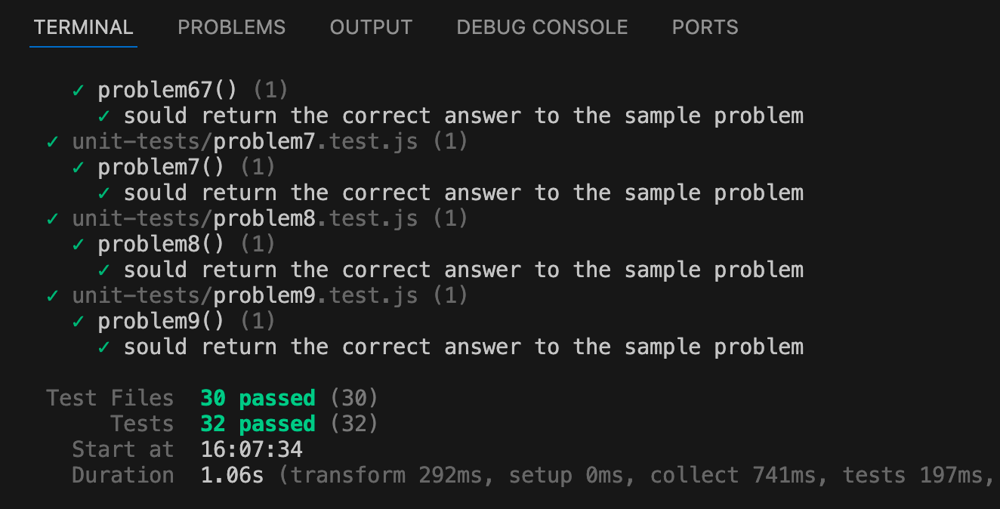

# Project Euler Problems 1-25 in JavaScript Node.js



## Introduction

[Project Euler](https://projecteuler.net/about) offers mathematical and computer programming challenges that encourages participants to develop new skills and find enjoyments in the world of mathematics. This project has been a challenging and fun way to demonstrate and practice existing software development skills and learn some new things!

## Technologies

| Name          | Description |
| ------------- | ----------- |
| Runtime       | Node.js     |
| Language      | JavaScript  |
| Unit Testing  | vitest      |
| Comments      | JSDoc       |
| Documentation | Markdown    |
| IDE           | VS Code     |
| Platform      | MacOS       |
| Repository    | GitHub.com  |

## Progress

This code repository contains functions that produce correct solutions for the following checked problems. The goal is to learn new things and have more fun by adding new solutions over time!

***UPDATE:*** Given the mathmatical limitations inherent in JavaScript (see Limitations section below), this project will end at problem 25. I will attempt to solve the next set of problems using Python in a Jupyter Notebook environment.

|                       |                       |                       |                       |                       | 
| --------------------: | --------------------: | --------------------: | --------------------: | --------------------: | 
|  :heavy_check_mark: 1 |  :heavy_check_mark: 2 |  :heavy_check_mark: 3 |  :heavy_check_mark: 4 |  :heavy_check_mark: 5 |
| :heavy_check_mark: 6 |  :heavy_check_mark: 7 |  :heavy_check_mark: 8 |  :heavy_check_mark: 9 | :heavy_check_mark: 10 |
| :heavy_check_mark: 11 | :heavy_check_mark: 12 | :heavy_check_mark: 13 | :heavy_check_mark: 14 | :heavy_check_mark: 15 |
| :heavy_check_mark: 16 | :heavy_check_mark: 17 | :heavy_check_mark: 18 | :heavy_check_mark: 19 | :heavy_check_mark: 20 |
| :heavy_check_mark: 21 | :heavy_check_mark: 22 | :heavy_check_mark: 23 | :heavy_check_mark: 24 | :heavy_check_mark: 25 |                    


## Limitations

Solving some questions requires working with JavaScript's 21 digit limit on integers. By default, any integer over 21 digits is converted to an exponent expression. This can make determining the correct solution impossible.

```javascript
let number21 = 10000000000000000000;
consol.log(number21);
// Prints: 10000000000000000000

let number22 = 1000000000000000000000;
console.log(number22);
// Prints: 1e+21
```

There are a number of ways around this issue all of which have some limitations. The [toPrecision()](https://developer.mozilla.org/en-US/docs/Web/JavaScript/Reference/Global_Objects/Number/toPrecision) function is very helpful for numbers containing upto 100 digits. But cannot be used accurately with larger numbers.

Therefore, some solutions in this project rely on the zsh shell's bc application. Executing this project on another platform would require editing the code for these functions. The command line statement is executed using the [Node.js Child Process](https://nodejs.org/api/child_process.html) module.

```javascript
// Example: Compute the a raised to the power of b
import cp from "child_process";
const result = cp.execSync(`bc --expression= ${a} ^ ${b}`);
```
